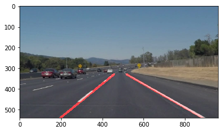

# **Finding Lane Lines on the Road** 

## Writeup Template

### You can use this file as a template for your writeup if you want to submit it as a markdown file. But feel free to use some other method and submit a pdf if you prefer.

---

**Finding Lane Lines on the Road**

The goals / steps of this project are the following:
* Make a pipeline that finds lane lines on the road
* Reflect on your work in a written report

[//]: # (Image References)

[image1]: ./examples/grayscale.jpg "Grayscale"

---

### Reflection

### 1. Describe your pipeline. As part of the description, explain how you modified the draw_lines() function.

Five methods are used for my pipeline. First, I converted the images to grayscale because I assume that the color is not important to find lane lines. Second, I apply Gaussian blur method for the edge detection. This prevents useless edge detection due to noise or very small objects. Next, Canny transfrom is utilized with low and high threshold values (`60` and `100`). Because many non-informative  edges are detected in the Canny transform process, I set an triangular region of interest (ROI). Finally, Hough line transform is applied to one from the masked Canny transform result.

In order to draw a single line on the left and right lanes, I modified the draw_lines() function by determining signs of their slopes (positive: right, negative: left). Next, for each direction, I gather x and y points and estimate the slope (m) and bias (b) using `np.polifit(x, y, degree=1)`.

If you'd like to include images to show how the pipeline works, here is how to include an image: 

### 2. Identify potential shortcomings with your current pipeline
One potential shortcoming would be what would happen when something like a stick is on between the lanes. The reason is that this pipeline assumes there is no object whose shape is rectangle between the lane lines.

Another shortcoming could occur inconsitency of detecting lane lines when lane segments are irregular. In addition, the performance is not robust on the highly curved road.

### 3. Suggest possible improvements to your pipeline

A possible improvement would be to develop a module to identify object between the lanes. 
Another potential improvement could be to research a curve transrom for the curved road instead of Hough line transform.
